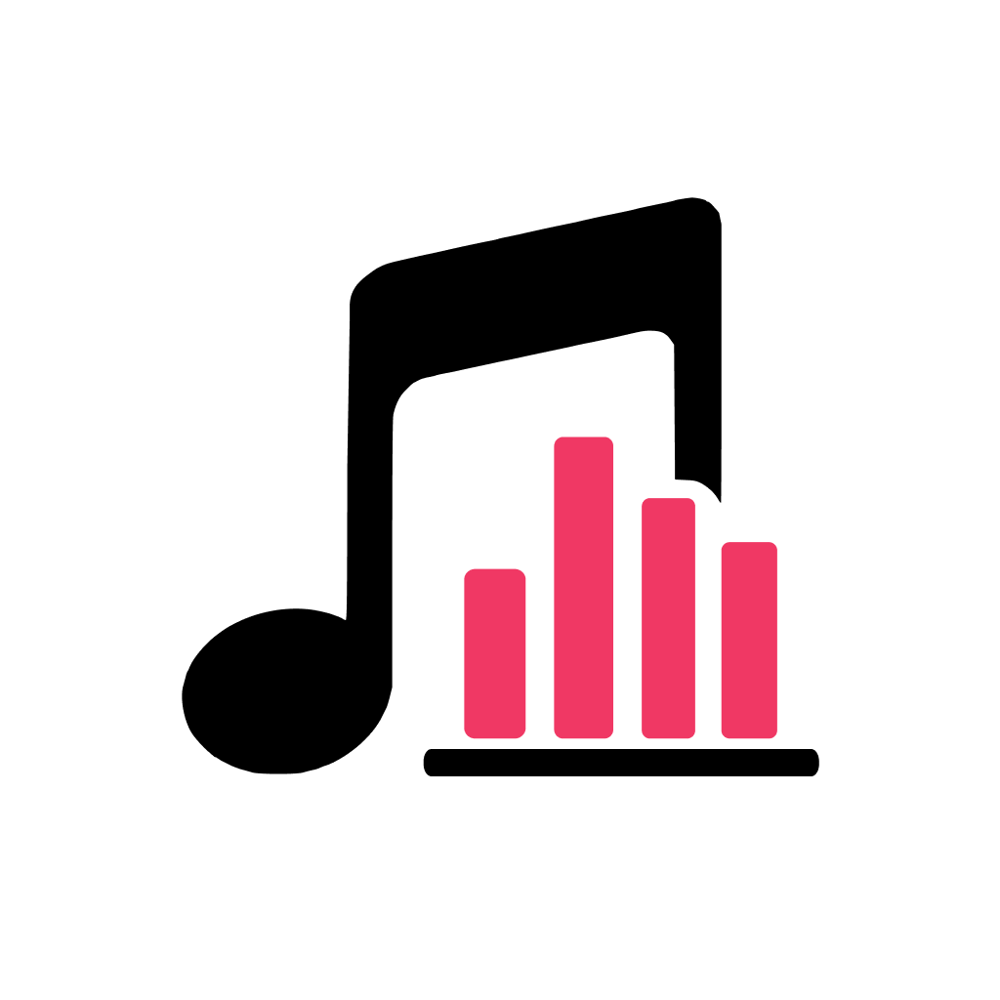

# 🎵 MusicLibrary

## Apple Music × iOS Music Listening Analytics App

**MusicLibrary** は、Apple Music の再生情報をもとに、
**楽曲・アーティスト・アルバムのランキングや統計情報を表示する iOS アプリ**です。

SwiftUI と MusicKit を中心に構成した、
**個人開発・ポートフォリオ目的のプロジェクト**です。

<p align="center">
  
</p>

---

## 📌 アプリ開発のきっかけ

Apple Music を利用する中で特に不満に感じていたのが、
**CD 音源として取り込んだ楽曲が Apple Music の Replay（ランキング）に一切反映されない**点でした。

好きなアーティストの CD を購入し、**このサブスクリプション全盛の時代に、あえて音源を取り込み、
PC から iPhone へ転送して聴いているにもかかわらず、** それらの再生履歴が「存在しないもの」として扱われ、
ランキングや統計の対象外になってしまうことに違和感を覚えました。

> 「せっかく聴いている音楽なのに、なぜ分析できないのか」
> 「自分の音楽の聴き方を、もっと正確に振り返れないのか」

そう感じたことが、**MusicLibrary** 開発のきっかけです。

本アプリでは、

- Apple Music のストリーミング楽曲だけでなく
- CD 取り込み音源を含めた再生体験を整理・分析し
- アーティスト・アルバム・楽曲単位で可視化する

ことで、**自分だけの音楽リスニング履歴を記録・分析できる仕組み**を目指しています。

また、分析したランキングや統計情報を
**SNS などで共有できたら面白いのではないか**と考え、
「個人で楽しむ」だけでなく「人に見せたくなる」体験も意識して設計しています。

Apple Music の API 制約がある中でも、
取得可能なデータを最大限活用し、
**制約下でどこまで価値ある分析体験を提供できるか**をテーマに開発しています。

---

## 📱 アプリ概要

Apple Music × ローカル音源を統合分析する音楽リスニング分析アプリです。

### タブ構成

アプリは 4 つのタブで構成されています。

| タブ | 概要 |
|------|------|
| **ホーム** | サマリ・パーソナリティ・TOP5・トップアーティスト |
| **ランキング** | 楽曲/アーティスト/アルバム別ランキング |
| **月別** | 月別リスニングレポート |
| **more** | パーソナリティ詳細・年間レポート・ライブラリ・統計・設定 |

---

### 主な機能

#### 🏠 ホーム
- リスニングサマリ（総再生回数・総再生時間・アーティスト数・CD取り込み曲数）
- あなたのパーソナリティ（現在のリスニングスタイル）
- 再生回数 TOP5 楽曲（**期間切替付き**: 全期間 / 7日 / 30日 / 3ヶ月）
- トップアーティスト一覧（横スクロール）

#### 📊 ランキング
- 楽曲・アーティスト・アルバム別ランキング（セグメント切替）
- **期間フィルタ**: 全期間 / 7日 / 30日 / 3ヶ月（初期: 7日）
  - **全期間**: Apple Music の累積再生数をそのまま集計
  - **7日 / 30日 / 3ヶ月**: アプリ導入時からの再生履歴で集計（期間内の実回数）
- 検索バー（楽曲タイトル・アーティスト名での絞り込み）
- 各行タップで詳細画面へ遷移

#### 📅 月別レポート
- 月単位の総再生回数・総再生時間
- 前月比較（増減率バッジ表示）
- 日別再生数グラフ（Swift Charts）
- **ジャンル別再生分布**（割合バー + 件数）
- **リスニングパーソナリティ判定**（その月のスタイルと判定理由）
- TOP5 楽曲・TOP3 アーティスト
- 「レポートを共有」で Wrapped 風ストーリー画面へ
- **データ精度バナー**（蓄積データが少ない場合に精度レベルを表示）

#### 🎭 音楽パーソナリティ
- 再生履歴から **12 種類のパーソナリティ**を判定
- 各パーソナリティに固有のアイコン（SwiftUI Canvas 描画）とアニメーション
- パーソナリティ一覧と詳細スコアを表示

| パーソナリティ | 説明 |
|---|---|
| レジェンド | 圧倒的な再生数を誇る音楽の達人 |
| 推しが本気 | 1 人のアーティストを愛し抜く一途なリスナー |
| 一点集中型 | お気に入りに全力を注ぐ集中リスナー |
| ヘビロテ職人 | 同じ曲を繰り返し聴き込む熟成派 |
| 音楽探検家 | 新しい音楽を貪欲に探し続ける冒険者 |
| 固定リスナー | 信頼のラインナップを守り続けるコア派 |
| 成長型リスナー | 常に新曲でアップデートし続ける進化型 |
| 懐古リスナー | 時間をかけて育てた名曲を愛でるクラシック派 |
| ジャンル偏愛家 | 特定ジャンルへの深い愛を持つ偏愛家 |
| バランス型 | ジャンルもアーティストも偏りなく楽しむ万能型 |
| コレクター（CD） | CD 取り込み音源を大切にするアナログ派 |
| サブスク派 | Apple Music ストリーミングを使いこなす現代派 |

#### 🎉 年間レポート
- 年単位の総再生回数・総再生時間・前年比
- ジャンル別再生分布
- リスニングパーソナリティ判定（その年のスタイルと理由）
- 月別再生数グラフ
- TOP10 楽曲・TOP10 アーティスト
- **Wrapped 風ストーリー画面**（7 ページ、自動進行 10 秒/ページ）
  1. オープニング（ユーザー名表示）
  2. 総再生回数
  3. ジャンル分布
  4. TOPアーティスト
  5. TOP楽曲
  6. 最も聴いた月
  7. パーソナリティ判定
- SNS シェア（Instagram Story / X 対応）

#### 📚 ライブラリ
- 楽曲・アーティスト・アルバム横断検索
- 検索履歴の保存（最新 5 件）
- お気に入り機能（ハート登録 → ホーム画面でまとめて表示）
- ソート機能（再生回数順 / タイトル順 / 最近聴いた順 / 追加日順）
- 楽曲 / アーティスト / アルバム詳細画面

#### 📈 統計
- 全体統計（総再生数・時間・アーティスト数・アルバム数）
- 音源の内訳（CD 取り込み vs Apple Music ストリーミング）
- 最も聴いた楽曲・アーティスト
- ジャンル別再生分布（円グラフ + 割合バー）

#### 🎨 アートワーク
- Apple Music 楽曲・アルバムアートワーク自動取得
- アーティスト画像を Deezer / iTunes Search API から自動取得
- ユーザー手動変更（長押しで写真ライブラリから選択）
- メモリキャッシュ + ディスクキャッシュで再取得を最小化

#### 🧩 ホーム画面ウィジェット

| ウィジェット | サイズ | 内容 |
|-------------|--------|------|
| 今日の再生数 | Small | 今日の再生回数 |
| 今週のTOP3 | Small / Medium | 今週 TOP3 楽曲 |
| 今月のサマリー | Large | 月間統計まとめ |
| 時間帯ヒートマップ | Medium | 24時間帯別再生ヒートマップ |

#### 🔴 Live Activity（Dynamic Island / ロック画面）
- 再生中の楽曲タイトル・アーティスト名をリアルタイム表示
- Dynamic Island 拡張表示・ロック画面バナーに対応

#### 🔔 通知機能
- 週次レポート通知（毎週月曜 9:00）
- 月次レポート通知（毎月 1 日 10:00）
- 久しぶりのお気に入り楽曲通知

#### 👤 プロフィール・設定
- ユーザー名・アイコン設定（ストーリー画面に反映）
- iCloud 同期（再生履歴の複数端末共有）
- 通知の個別オン/オフ
- 再生履歴の再構築（Apple Music 再生数から再生成）

---

## 🛠 使用技術

### 言語・フレームワーク

| 技術 | 用途 |
|------|------|
| **Swift 5.9+** | 全コード |
| **SwiftUI** | UI 全体（Canvas API によるカスタムアイコン描画含む） |
| **MusicKit** | Apple Music 認証 |
| **MediaPlayer (MPMediaQuery)** | ローカル音源・再生回数取得 |
| **Core Data** | 再生履歴・お気に入り永続化 |
| **CloudKit** | iCloud 同期（NSPersistentCloudKitContainer） |
| **WidgetKit** | ホーム画面ウィジェット |
| **ActivityKit** | Live Activity（Dynamic Island / ロック画面） |
| **Charts** | 各種グラフ描画（日別・月別・ジャンル円グラフ） |
| **PhotosUI** | カスタム画像選択 |
| **UserNotifications** | ローカル通知 |
| **BackgroundTasks** | 定期バックグラウンド同期 |

### 外部 API

| API | 用途 | 備考 |
|------|------|------|
| **Deezer API** | アーティスト人物画像取得 | 無料・APIキー不要 |
| **iTunes Search API** | アルバムジャケット取得（フォールバック） | 無料・APIキー不要 |

### 開発環境

- **Xcode 16+**
- **iOS 17+**
- **macOS Sequoia+**

---

## 🧱 アーキテクチャ

### MVVM パターン

```
View (SwiftUI) ←→ ViewModel (@MainActor / ObservableObject) ←→ Service / Repository
                                                                    ↓
                                                          MediaPlayer / Core Data / Network
```

### 主要レイヤー

| レイヤー | 役割 |
|---------|------|
| **View** | SwiftUI で UI 構築。ViewModel から流れてくるデータを表示するだけ |
| **ViewModel** | `@Published` で状態管理。Service を介してデータ取得・加工 |
| **Service** | ビジネスロジック（認証・履歴差分計算・パーソナリティ分析・画像取得など） |
| **Repository** | Core Data の取得・保存を抽象化 |
| **Model** | `Track` / `Artist` / `Album` / `PlayHistoryEntry` などのドメインモデル |

### 設計上の工夫

#### 🔁 Apple Music の API 制約への対応

Apple Music の `MPMediaItem` から取れる情報は限定的です:

- ✅ `playCount`（合計再生回数）
- ✅ `lastPlayedDate`（最後の再生日のみ）
- ❌ 「いつ何回再生したか」の時系列履歴は取れない

そこで本アプリでは独自に以下の仕組みを実装:

1. **アプリ起動時に `playCount` のスナップショットを Core Data に保存**
2. **次回起動時に差分を検出 → 履歴として記録**
3. **初回起動時はバックフィル処理**（既存の `playCount × duration` を遡って履歴化）

この仕組みにより、**Apple Music Replay には反映されない CD 取り込み音源も含めた**、月別・日別の精密な分析を実現しています。

#### 📊 履歴精度レベルの管理

アプリ導入直後は差分履歴が少なく分析精度が低いため、`HistoryAccuracyLevel` で段階管理:

| レベル | 差分同期回数 | 状態 |
|--------|------------|------|
| `baseline` | 0 回 | 導入直後。スナップショットのみ |
| `early` | 1〜4 回 | データ蓄積中 |
| `developing` | 5〜14 回 | 月別・日別分析が利用可能 |
| `established` | 15 回以上 | 高精度 |

月別レポートには精度が低い段階で精度バナーを表示し、ユーザーに現状を伝えます。

#### 🎭 パーソナリティ分析エンジン

`PersonalityAnalysisEngine` がリスニング履歴から各パーソナリティのスコアを算出:

- 再生回数・アーティスト集中度・ジャンル多様性・CD 比率・曲のローテーション速度などの指標を組み合わせ
- **排他グループ制御**（例: 音楽探検家 ↔ 固定リスナーは同時付与不可）
- 判定理由を自然言語で生成し、月別・年別レポートに表示

#### 📊 期間別ランキングの集計方式

| 期間 | データソース | 説明 |
|------|------------|------|
| 全期間 | `MPMediaItem.playCount` | Apple Music の累積再生数 |
| 7日 / 30日 / 3ヶ月 | `PlayHistoryRepository` | アプリが記録した期間内の再生履歴のみを集計 |

#### ⚡ 大量データへのバッチ処理

6000 曲規模のライブラリでも動作するよう、Core Data 操作はチャンク化:

- 50 楽曲ずつバックグラウンドコンテキストで処理
- 1 曲あたり最大 300 件まで履歴生成（パフォーマンスと精度のバランス）
- メモリ膨張を防ぐため `bgContext.reset()` で逐次解放

#### 🎨 アートワーク多段フォールバック

```
カスタム画像（手動設定）
    ↓ なければ
MPMediaItemArtwork（楽曲組み込み）
    ↓ なければ
Deezer API（人物画像が強い）
    ↓ なければ
iTunes Search API（日本語に強い）
    ↓ なければ
プレースホルダー
```

メモリキャッシュ + ディスクキャッシュで、再取得を最小化しています。

---

## 📂 プロジェクト構成

```
MusicLibrary/
├── App/
│   ├── MusicLibraryApp.swift           # アプリエントリポイント
│   └── ContentView.swift               # ルートView / TabView（4タブ）
├── Models/
│   ├── Track.swift                     # 楽曲モデル
│   ├── Artist.swift                    # アーティストモデル
│   ├── Album.swift                     # アルバムモデル
│   ├── PlayHistoryEntry.swift          # 再生履歴エントリ（Core Data Entity）
│   ├── HistoryAccuracyLevel.swift      # 履歴精度レベル管理
│   ├── LibrarySortOption.swift         # ライブラリソートオプション
│   └── NowPlayingActivityAttributes.swift # Live Activity 属性
├── Persistence/
│   ├── PersistenceController.swift     # Core Data Stack（CloudKit対応）
│   └── PlayHistoryRepository.swift     # 再生履歴クエリ（期間指定・楽曲別など）
├── Services/
│   ├── MusicAuthService.swift          # MusicKit 認証
│   ├── MusicLibraryService.swift       # MPMediaQuery 経由でライブラリ取得
│   ├── PlayHistoryTracker.swift        # 差分検知・バックフィル・精度レベル管理
│   ├── PersonalityAnalysisEngine.swift # パーソナリティ判定ロジック
│   ├── ArtworkService.swift            # アートワーク管理・キャッシュ
│   ├── DeezerSearchService.swift       # Deezer API クライアント
│   ├── iTunesSearchService.swift       # iTunes Search API クライアント
│   ├── FavoriteService.swift           # お気に入り管理
│   ├── SearchHistoryService.swift      # 検索履歴管理
│   ├── NotificationService.swift       # ローカル通知（週次・月次・再発見）
│   ├── NowPlayingActivityManager.swift # Live Activity 制御
│   ├── UserProfileService.swift        # ユーザー名・アイコン管理
│   ├── CloudSyncService.swift          # iCloud 同期管理
│   ├── HapticsManager.swift            # ハプティック共通管理
│   ├── ShareImageRenderer.swift        # SwiftUI → UIImage 変換
│   ├── SocialShareService.swift        # SNS シェア処理
│   └── BackgroundSyncManager.swift     # バックグラウンド同期スケジュール
├── ViewModels/
│   ├── LibraryViewModel.swift          # ライブラリ管理
│   ├── RankingViewModel.swift          # ランキング（期間別・ホーム用）
│   ├── StatisticsViewModel.swift       # 全体統計
│   ├── MonthlyReportViewModel.swift    # 月別レポート・パーソナリティ
│   ├── YearlyReportViewModel.swift     # 年間レポート・パーソナリティ
│   ├── PersonalityAnalysisViewModel.swift # パーソナリティ詳細分析
│   ├── TimeOfDayViewModel.swift        # 時間帯分析
│   ├── GenreAnalysisViewModel.swift    # ジャンル分析
│   └── TrackDetailViewModel.swift      # 楽曲詳細
├── Views/
│   ├── Auth/                           # Apple Music 連携画面
│   ├── Onboarding/                     # 初回起動オンボーディング
│   ├── Home/                           # ホーム画面
│   ├── Ranking/                        # ランキング画面（期間切替・検索付き）
│   ├── Library/                        # ライブラリ・検索・お気に入り
│   ├── MonthlyReport/                  # 月別レポート
│   ├── YearlyReport/                   # 年間レポート
│   ├── Personality/                    # パーソナリティ詳細分析
│   ├── Statistics/                     # 全体統計・ジャンル分析
│   ├── Genre/                          # ジャンル別分布（円グラフ）
│   ├── TimeOfDay/                      # 時間帯・曜日別分析
│   ├── TrackDetail/                    # 楽曲詳細
│   ├── ArtistDetail/                   # アーティスト詳細・アルバム詳細
│   ├── Story/                          # Wrapped 風ストーリー（7ページ）
│   ├── Share/                          # SNS シェアカード生成
│   ├── Settings/                       # 設定・プロフィール編集
│   ├── More/                           # more タブメニュー
│   ├── Developer/                      # 開発者デバッグ画面
│   └── Components/                     # 共通 UI コンポーネント
│       ├── PersonalityBadgeView.swift  # パーソナリティアイコン（Canvas描画・アニメーション）
│       ├── AccuracyLevelBanner.swift   # 履歴精度レベルバナー
│       ├── GenreReportSection.swift    # ジャンル分布セクション（レポート用）
│       ├── ArtworkView.swift           # アートワーク表示・SectionHeader
│       ├── EditableArtworkView.swift   # 長押しで画像変更可能なアートワーク
│       ├── StatCardView.swift          # 統計カード
│       └── SplashView.swift            # スプラッシュ画面
├── Widget/
│   ├── MusicLibraryWidgetBundle.swift  # ウィジェットバンドル
│   ├── TodayPlaysWidget.swift          # 今日の再生数（Small）
│   ├── WeeklyTopWidget.swift           # 今週の TOP3 楽曲（Small/Medium）
│   ├── MonthlySummaryWidget.swift      # 月間サマリー（Large）
│   ├── HourlyHeatmapWidget.swift       # 時間帯ヒートマップ（Medium）
│   └── NowPlayingLiveActivity.swift    # Live Activity（Dynamic Island / ロック画面）
└── Resources/
    └── MusicLibrary.xcdatamodeld/     # Core Data スキーマ
```

---

## ⚙️ セットアップ

### 1. リポジトリをクローン

```bash
git clone https://github.com/yourusername/MusicLibrary.git
cd MusicLibrary
```

### 2. Xcode でプロジェクトを開く

```bash
open MusicLibrary.xcodeproj
```

### 3. Bundle Identifier を変更

Signing & Capabilities タブで自身の Apple ID に紐づく Bundle Identifier に変更してください。

### 4. Capabilities

- **App Groups**: `group.com.yourcompany.MusicLibrary` を作成（ウィジェット・Live Activity との共有用）
- **Apple Music** (MusicKit) を有効化
- **Background Modes** → Background fetch を有効化
- **Push Notifications**（Live Activity 使用時）

### 5. Info.plist 追記

```xml
<key>NSAppleMusicUsageDescription</key>
<string>音楽ライブラリの再生情報を分析するために使用します</string>

<key>NSPhotoLibraryUsageDescription</key>
<string>アーティスト・アルバム画像のカスタマイズに使用します</string>

<key>LSApplicationQueriesSchemes</key>
<array>
    <string>instagram-stories</string>
</array>
```

### 6. ビルド & 実行

`⌘+R` で実行。Apple Music へのアクセス許可を与えてください。

> **注意**: 実機での実行を推奨します。シミュレータでは MediaPlayer による楽曲取得・再生回数の取得ができません。

---

## 🚧 既知の制約・今後の課題

### Apple Music API の制約

- 楽曲再生のリアルタイム検知は不可
  → アプリ起動時の差分検知（スナップショット比較）で対応
- 履歴の正確な日時は `lastPlayedDate` 起点の近似値
- アプリ導入前の時系列履歴は取得不可（バックフィルで擬似的に補完）

### データ精度

- 差分同期が 5 回未満の段階では月別・日別分析の精度が低い
- 利用を続けることで精度が向上（`HistoryAccuracyLevel` で可視化）

### パフォーマンス

- 大規模ライブラリ（6000 曲以上）でのバックフィルに数十秒かかる
- バッチ処理（50 曲ずつ）でメモリ膨張は抑制済み

### iCloud 同期

- `NSPersistentCloudKitContainer` で実装済み
- 利用には有料 Apple Developer アカウントが必要

### 今後追加したい機能

- [ ] 楽曲詳細での歌詞表示（Genius API 連携）
- [ ] 連続再生ストリーク機能
- [ ] AI による次に聴きたい楽曲推薦
- [ ] Apple Watch アプリ
- [ ] 時間帯別・曜日別分析の詳細画面

---

## 📝 設計メモ

### なぜ Core Data を選んだか

- iOS 標準でメンテナンスフリー
- App Group 経由でウィジェット拡張・Live Activity からも参照可能
- CloudKit 同期に拡張可能（`NSPersistentCloudKitContainer`）
- 38000 件規模の履歴でも安定動作

### なぜ Deezer API を選んだか

- アーティスト人物画像のカバー率が高い（特に海外アーティスト）
- 完全無料・API キー不要
- iTunes Search API では人物画像がほぼ取得不可

### パーソナリティアイコンの実装方針

- UIImage / SF Symbols を使わず、SwiftUI `Canvas` API で全アイコンをコード描画
  → 任意サイズへのスケーリング、グラデーション背景との統一感、アニメーションの自由度を確保
- `@State private var phase` / `spin` で easeInOut / linear のループアニメーションを管理
- `PersonalityAnalysisEngine` のスコア計算とアイコン・アニメーションを完全分離

### なぜ MVVM か

- SwiftUI との親和性が高い
- Service 層で Apple Music API の制約を吸収しやすい
- ViewModel 単位でテスト可能な構造

---

## 📄 ライセンス

このプロジェクトは個人開発のポートフォリオ用途で公開しています。
コードは自由に参照いただいて構いませんが、商用利用についてはお問い合わせください。

---

## 🙋‍♂️ 作者

ポートフォリオ・スキル向上を目的とした個人開発です。
ご意見・フィードバックがあればお気軽にお寄せください。
