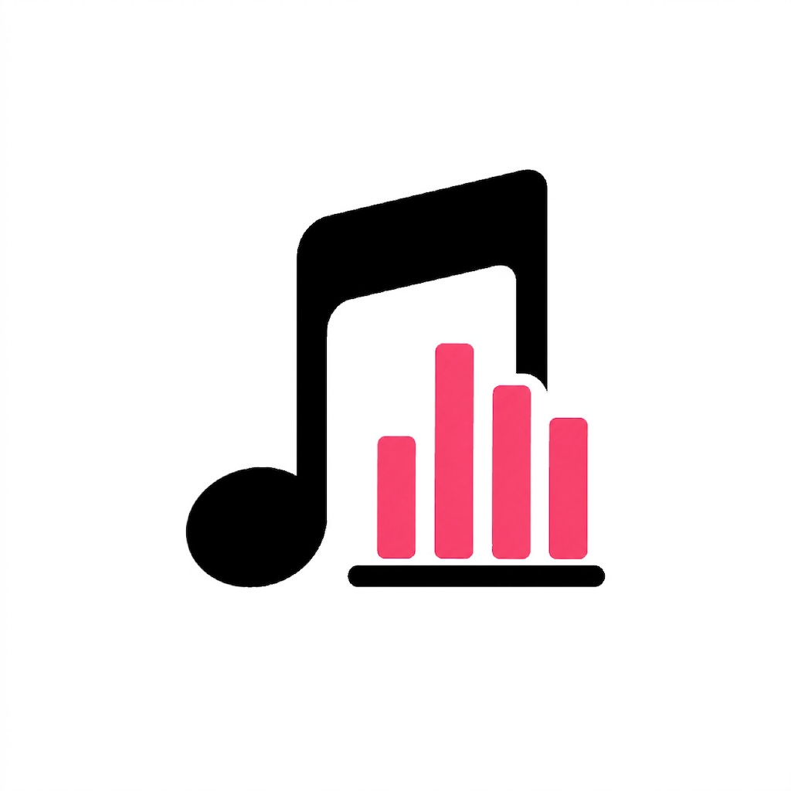

# 🎵 MusicLibrary

## Apple Music × iOS Music Listening Analytics App

**MusicLibrary** は、Apple Music の再生情報をもとに、
**楽曲・アーティストのランキングや統計情報を表示する iOS アプリ**です。

SwiftUI と MusicKit を中心に構成した、
**個人開発・ポートフォリオ目的のプロジェクト**です。

<p align="center">
  
</p>

---

## 📌 アプリ開発のきっかけ

Apple Music を利用する中で特に不満に感じていたのが、
**CD 音源として取り込んだ楽曲が Apple Music の Replay（ランキング）に一切反映されない**点でした。

好きなアーティストの CD を購入し、**このサブスクリプション全盛の時代に、あえて音源を取り込み、
PC から iPhone へ転送して聴いているにもかかわらず、** それらの再生履歴が「存在しないもの」として扱われ、
ランキングや統計の対象外になってしまうことに違和感を覚えました。

> 「せっかく聴いている音楽なのに、なぜ分析できないのか」
> 「自分の音楽の聴き方を、もっと正確に振り返れないのか」

そう感じたことが、**MusicLibrary** 開発のきっかけです。

本アプリでは、

- Apple Music のストリーミング楽曲だけでなく
- CD 取り込み音源を含めた再生体験を整理・分析し
- アーティスト・アルバム・楽曲単位で可視化する

ことで、**自分だけの音楽リスニング履歴を記録・分析できる仕組み**を目指しています。

また、分析したランキングや統計情報を
**SNS などで共有できたら面白いのではないか**と考え、
「個人で楽しむ」だけでなく「人に見せたくなる」体験も意識して設計しています。

Apple Music の API 制約がある中でも、
取得可能なデータを最大限活用し、
**制約下でどこまで価値ある分析体験を提供できるか**をテーマに開発しています。

本プロジェクトは、

- SwiftUI を用いた UI 構築
- MusicKit / ローカル音源の扱い
- MVVM による設計
- 音楽ドメイン特有の制約を踏まえた設計判断

を実践的に学ぶことを目的とした
**iOS エンジニアとしてのスキル向上とポートフォリオ作成を兼ねた個人開発**です。

---

## 📱 アプリ概要

Apple Music × ローカル音源を統合分析する音楽リスニング分析アプリです。

### 主な機能

#### 🏠 ホーム
- リスニングサマリ（総再生回数・総再生時間など）
- 再生回数 TOP5 楽曲
- トップアーティスト一覧

#### 📊 ランキング
- 楽曲・アーティスト・アルバム別ランキング
- 全期間 / 直近30日切替
- アーティスト/アルバムタップで詳細画面へ遷移

#### 📅 月別レポート
- 月単位の総再生回数・再生時間
- 前月比較（増減率表示）
- 日別再生数グラフ
- TOP楽曲・TOPアーティスト
- 「レポートを共有」で Wrapped 風ストーリー画面へ

#### 🕒 時間帯分析
- 24時間帯別の再生数ヒートマップ
- 曜日別の再生分布
- 「朝の人 / 夜更かし派」などのリスナータイプ判定

#### 📚 ライブラリ
- 楽曲・アーティスト・アルバム横断検索
- 検索履歴の保存（最新5件）
- ソート機能（再生回数順 / タイトル順 / 最近聴いた順 / 追加日順）
- お気に入り機能

#### 📈 統計
- 全体統計（総再生数・時間・アーティスト数など）
- 音源内訳（CD取り込み vs Apple Music）
- ジャンル別分布（円グラフ）

#### 🎉 年間レポート
- 年単位の集計
- Spotify Wrapped 風ストーリー画面（7ページ構成）
  - オープニング → 総再生回数 → ジャンル分布 → TOPアーティスト → TOP楽曲 → 最も聴いた月 → パーソナリティ判定
- SNS シェアカード生成（Instagram Story / X 対応）

#### 🎨 アートワーク
- Apple Music 楽曲・アルバムアートワーク自動取得
- アーティスト画像を Deezer / iTunes Search API から自動取得
- ユーザー手動変更（長押しで写真ライブラリから選択）

#### 🧩 ホーム画面ウィジェット
- 今日の再生回数（Small）
- 今週のTOP3楽曲（Small/Medium）
- 今月のサマリー（Large）
- 時間帯ヒートマップ（Medium）

#### 🔔 通知機能
- 週次レポート通知（毎週月曜 9:00）
- 月次レポート通知（毎月1日 10:00）
- 久しぶりのお気に入り楽曲通知

#### 👤 プロフィール
- ユーザー名・アイコン設定
- ストーリー画面に反映

---

## 🛠 使用技術

### 言語・フレームワーク

| 技術 | 用途 |
|------|------|
| **Swift 5.9+** | 全コード |
| **SwiftUI** | UI 全体 |
| **MusicKit** | Apple Music 認証 |
| **MediaPlayer (MPMediaQuery)** | ローカル音源・再生回数取得 |
| **Core Data** | 再生履歴・お気に入り永続化 |
| **WidgetKit** | ホーム画面ウィジェット |
| **Charts** | 各種グラフ描画 |
| **PhotosUI** | カスタム画像選択 |
| **UserNotifications** | ローカル通知 |
| **BackgroundTasks** | 定期同期 |

### 外部 API

| API | 用途 | 備考 |
|------|------|------|
| **Deezer API** | アーティスト人物画像取得 | 無料・APIキー不要 |
| **iTunes Search API** | アルバムジャケット取得（フォールバック） | 無料・APIキー不要 |

### 開発環境

- **Xcode 15+**
- **iOS 17+** (一部機能は iOS 16.1+)
- **macOS Sonoma+**

---

## 🧱 アーキテクチャ

### MVVM パターン

```
View (SwiftUI) ←→ ViewModel (@MainActor / ObservableObject) ←→ Service / Repository
                                                                    ↓
                                                          MediaPlayer / Core Data / Network
```

### 主要レイヤー

| レイヤー | 役割 |
|---------|------|
| **View** | SwiftUI でUI構築。ViewModel から流れてくるデータを表示するだけ |
| **ViewModel** | `@Published` で状態管理。Service を介してデータ取得・加工 |
| **Service** | ビジネスロジック（認証・履歴差分計算・画像取得など） |
| **Repository** | Core Data の取得・保存を抽象化 |
| **Model** | `Track` / `Artist` / `Album` などのドメインモデル |

### 設計上の工夫

#### 🔁 Apple Music の API 制約への対応

Apple Music の `MPMediaItem` から取れる情報は限定的です:

- ✅ `playCount`（合計再生回数）
- ✅ `lastPlayedDate`（最後の再生日のみ）
- ❌ 「いつ何回再生したか」の時系列履歴は取れない

そこで本アプリでは独自に以下の仕組みを実装:

1. **アプリ起動時に `playCount` のスナップショットを Core Data に保存**
2. **次回起動時に差分を検出 → 履歴として記録**
3. **初回起動時はバックフィル処理**（既存の `playCount × duration` を遡って履歴化）

この仕組みにより、**Apple Music Replay には反映されない CD 取り込み音源も含めた**、月別・時間帯別の精密な分析を実現しています。

#### ⚡ 大量データへのバッチ処理

6000曲規模のライブラリでも動作するよう、Core Data 操作はチャンク化:

- 50楽曲ずつバックグラウンドコンテキストで処理
- 1曲あたり最大300件まで履歴生成（パフォーマンスと精度のバランス）
- メモリ膨張を防ぐため `bgContext.reset()` で逐次解放

#### 🎨 アートワーク多段フォールバック

```
カスタム画像（手動設定）
    ↓ なければ
MPMediaItemArtwork（楽曲組み込み）
    ↓ なければ
Deezer API（人物画像が強い）
    ↓ なければ
iTunes Search API（日本語に強い）
    ↓ なければ
プレースホルダー
```

メモリキャッシュ + ディスクキャッシュで、再取得を最小化しています。

---

## 📂 プロジェクト構成

```
MusicLibrary/
├── App/
│   ├── MusicLibraryApp.swift           # アプリエントリポイント
│   └── ContentView.swift                # ルートView / TabView
├── Models/
│   ├── Track.swift                      # 楽曲モデル
│   ├── Artist.swift                     # アーティストモデル
│   ├── Album.swift                      # アルバムモデル
│   ├── PlayHistoryEntry.swift           # 再生履歴 / Core Data Entity
│   └── NowPlayingActivityAttributes.swift
├── Persistence/
│   ├── PersistenceController.swift      # Core Data Stack
│   └── PlayHistoryRepository.swift      # 履歴クエリ
├── Services/
│   ├── MusicAuthService.swift           # MusicKit 認証
│   ├── MusicLibraryService.swift        # MPMediaQuery 経由でライブラリ取得
│   ├── PlayHistoryTracker.swift         # 差分検知 + バックフィル
│   ├── ArtworkService.swift             # アートワーク管理 + キャッシュ
│   ├── DeezerSearchService.swift        # Deezer API クライアント
│   ├── iTunesSearchService.swift        # iTunes Search API クライアント
│   ├── FavoriteService.swift            # お気に入り管理
│   ├── SearchHistoryService.swift       # 検索履歴管理
│   ├── NotificationService.swift        # ローカル通知
│   ├── UserProfileService.swift         # ユーザー名 / アイコン
│   ├── HapticsManager.swift             # ハプティック共通管理
│   ├── ShareImageRenderer.swift         # SwiftUI → UIImage 変換
│   ├── SocialShareService.swift         # SNS シェア処理
│   └── BackgroundSyncManager.swift      # バックグラウンド更新
├── ViewModels/
│   ├── LibraryViewModel.swift
│   ├── RankingViewModel.swift
│   ├── StatisticsViewModel.swift
│   ├── MonthlyReportViewModel.swift
│   ├── YearlyReportViewModel.swift
│   ├── TimeOfDayViewModel.swift
│   ├── TrackDetailViewModel.swift
│   └── GenreAnalysisViewModel.swift
├── Views/
│   ├── Auth/                            # Apple Music 連携画面
│   ├── Onboarding/                      # 初回起動時のオンボーディング
│   ├── Home/                            # ホーム画面
│   ├── Ranking/                         # ランキング画面
│   ├── Library/                         # ライブラリ画面
│   ├── MonthlyReport/                   # 月別レポート
│   ├── YearlyReport/                    # 年間レポート
│   ├── TimeOfDay/                       # 時間帯分析
│   ├── TrackDetail/                     # 楽曲詳細
│   ├── ArtistDetail/                    # アーティスト詳細
│   ├── AlbumDetail/                     # アルバム詳細
│   ├── Statistics/                      # 統計画面
│   ├── Settings/                        # 設定 / プロフィール
│   ├── More/                            # その他メニュー
│   ├── Story/                           # Wrapped風ストーリー画面
│   └── Components/                      # 共通UIコンポーネント
├── Widget/
│   ├── MusicLibraryWidgetBundle.swift
│   ├── TodayPlaysWidget.swift           # 今日の再生数
│   ├── WeeklyTopWidget.swift            # 今週のTOP3
│   ├── MonthlySummaryWidget.swift       # 月間サマリー (Large)
│   └── HourlyHeatmapWidget.swift        # 時間帯ヒートマップ (Medium)
└── Resources/
    └── Info.plist 関連
```

---

## ⚙️ セットアップ

### 1. リポジトリをクローン

```bash
git clone https://github.com/yourusername/MusicLibrary.git
cd MusicLibrary
```

### 2. Xcode でプロジェクトを開く

```bash
open MusicLibrary.xcodeproj
```

### 3. Bundle Identifier を変更

Signing & Capabilities タブで自身の Apple ID に紐づく Bundle Identifier に変更してください。

### 4. Capabilities

- **App Groups**: `group.com.yourcompany.MusicLibrary` を作成
- **Apple Music** (MusicKit) を有効化
- **Background Modes** → Background fetch を有効化

### 5. Info.plist 追記

```xml
<key>NSAppleMusicUsageDescription</key>
<string>音楽ライブラリの再生情報を分析するために使用します</string>

<key>NSPhotoLibraryUsageDescription</key>
<string>アーティスト・アルバム画像のカスタマイズに使用します</string>

<key>LSApplicationQueriesSchemes</key>
<array>
    <string>instagram-stories</string>
</array>
```

### 6. ビルド & 実行

`⌘+R` で実行。Apple Music へのアクセス許可を与えてください。

---

## 🚧 既知の制約・今後の課題

### Apple Music API の制約

- 楽曲再生のリアルタイム検知は不可
- → アプリ起動時の差分検知で対応
- 履歴の正確な日時は `lastPlayedDate` 起点の近似値

### iCloud 同期

- `NSPersistentCloudKitContainer` で実装済み
- 利用には有料 Apple Developer アカウントが必要

### パフォーマンス

- 大規模ライブラリ（6000曲以上）でのバックフィルに数十秒かかる
- バッチ処理でメモリ膨張は抑制済み

### 今後追加したい機能

- [ ] Live Activity 対応
- [ ] 楽曲詳細での歌詞表示（Genius API 連携）
- [ ] 連続再生ストリーク機能
- [ ] AI による次に聴きたい楽曲推薦
- [ ] Apple Watch アプリ

---

## 📝 設計メモ

### なぜ Core Data を選んだか

- iOS 標準でメンテナンスフリー
- App Group 経由で Widget Extension からも参照可能
- CloudKit 同期に拡張可能
- 38000件規模の履歴でも安定動作

### なぜ Deezer API を選んだか

- アーティスト人物画像のカバー率が高い（特に海外アーティスト）
- 完全無料・APIキー不要
- iTunes Search API では人物画像がほぼ取得不可

### なぜ MVVM か

- SwiftUI との親和性が高い
- Service 層で Apple Music API の制約を吸収しやすい
- ViewModel 単位でテスト可能な構造

---

## 📄 ライセンス

このプロジェクトは個人開発のポートフォリオ用途で公開しています。
コードは自由に参照いただいて構いませんが、商用利用についてはお問い合わせください。

---

## 🙋‍♂️ 作者

ポートフォリオ・スキル向上を目的とした個人開発です。
ご意見・フィードバックがあればお気軽にお寄せください。